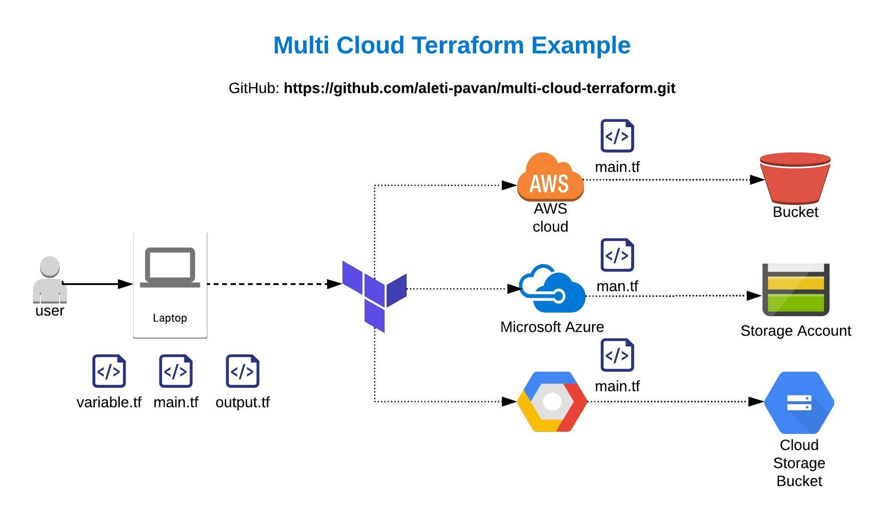
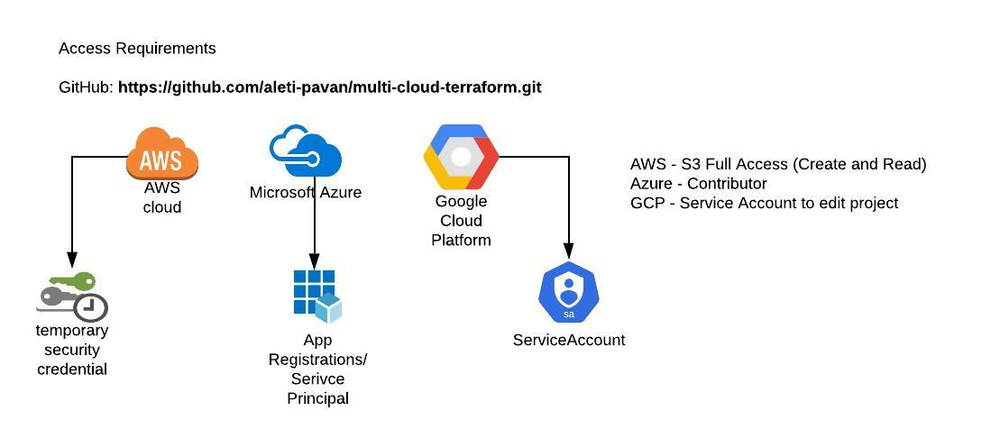

# multi-cloud-terraform
This repository is to create resources in AWS, Azure and GCP in single project - Cloud Agnostic

## Architecture Overview




__Note:__ you must have `aws` and `azure` CLIs configured in the system, otherwise you are required to pass service principal for azure and api credentials for aws.

## Access




## Commands

### Clone

`git clone https://github.com/aleti-pavan/multi-cloud-terraform.git`

### Create

```

terraform init

terraform plan or terraform -out <planfile>

terraform apply -auto-approve  (or) terraform apply <planfile>


```

### Destroy

`terraform destroy -auto-approve`
